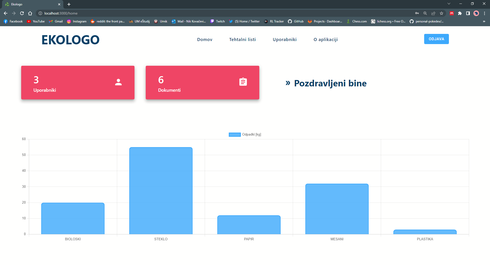

# Ensuring Security in Modern Web Development Using JWT Standard

In modern web development we face an issue that is authentication, which is migrating from server-side to client-side, so web solutions stay scalable. Which is why in our thesis, we present identification tokens called JWT (JSON Web Token) that ensure security in modern web applications. JWT is a standard for safely passing claim in space constrained environments, usually between a server and a client.

## Purpose

This project was developed as a practical part of my thesis on the JWT Standard. The goal of this project was to build a full-stack application that uses signed JSON Web Tokens to ensure secure access to our web application. 

## Features

This application was developed to help clients with recycling. It enables users to:

- manage users
- manage recycling documents
- visualize data with charts

## Tech Stack

- **React.js** for frontend
- **Express.js** for backend
- **PostgreSQL** for the database

### Aditional libraries

- [jsonwebtoken](https://github.com/auth0/node-jsonwebtoken#readme) - An implementation of JSON Web Tokens.
- [bcrypt](https://github.com/kelektiv/node.bcrypt.js#readme) - A library to help you hash passwords.
- [MaterialUI](https://mui.com/) - The React component library you always wanted
- [chart.js](https://www.chartjs.org/) - Simple yet flexible JavaScript charting library for the modern web

## Getting started

These instructions will get you a copy of the project up and running on your local machine for development and testing purposes.

### Prerequisites

- Node.js
- npm (or yarn)
- postgres 14+

### Installing

1. Clone the repository

`git clone https://github.com/nikkovacevic/diplomska.git`

#### Database

Create the database by copying the sql script found [here](https://github.com/nikkovacevic/diplomska/blob/main/backend/database.sql)
into your postgres shell of choice to prepare the database.

#### Backend

1. Navigate to folder `backend`

`cd backend`

2. Install the dependencies

`npm install`

3. Start the development server

`node index.js`

#### Frontend

1. Navigate to folder `frontend/ekologo`

`cd frontend/ekologo`

2. Install the dependencies

`npm install`

3. Start the development server

`npm start`

4. Enter the credentials

- email: nik@mail.com
- password: geslonik

## Thesis 

My thesis is available at https://dk.um.si/Dokument.php?id=161916&lang=slv

